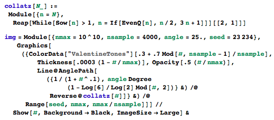

# collatz

[Collatz conjecture](https://en.wikipedia.org/wiki/Collatz_conjecture) visualization in Wolfram Mathematica.

The generating code is fairly simple,

Forked from [level1807/collatz](https://github.com/level1807/collatz).
